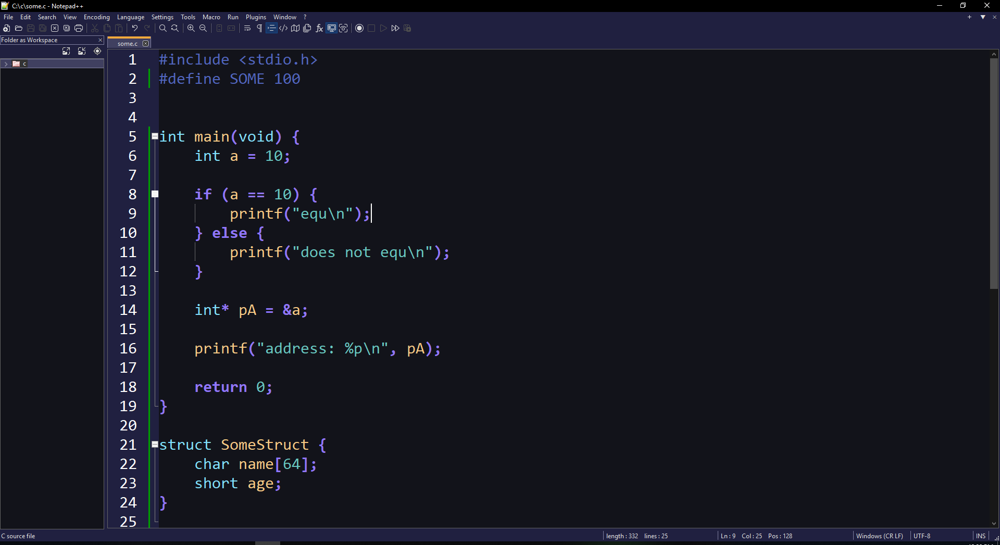

It is like: https://github.com/daltonmenezes/aura-theme

# Installation guide:

Go to C:\Users\YourUserName\AppData\Roaming\Notepad++

If you want, you can make a backup of your current theme and config.xml by copying stylers.xml and config.xml to another location.

If you made a backup, you can move/copy these two files back to the folder

Copy/move these 2 files to C:\Users\YourUserName\AppData\Roaming\Notepad++:

config.xml

stylers.xml

# Languages supported by this theme (There will be more later):

C

Python

Batch

# Preview:

